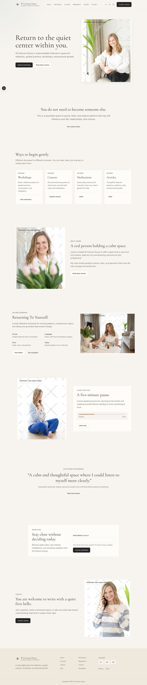
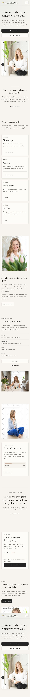
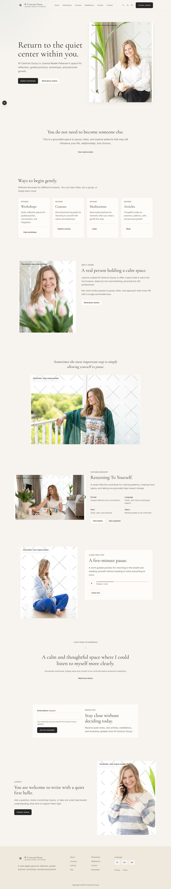
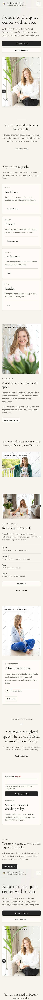
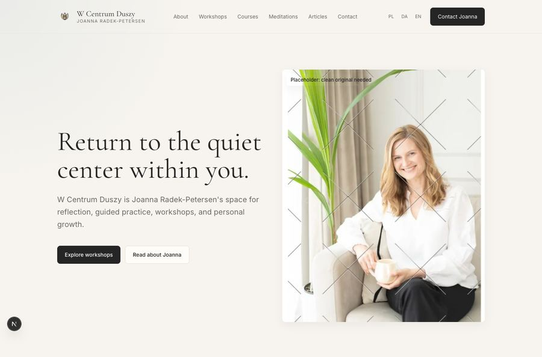
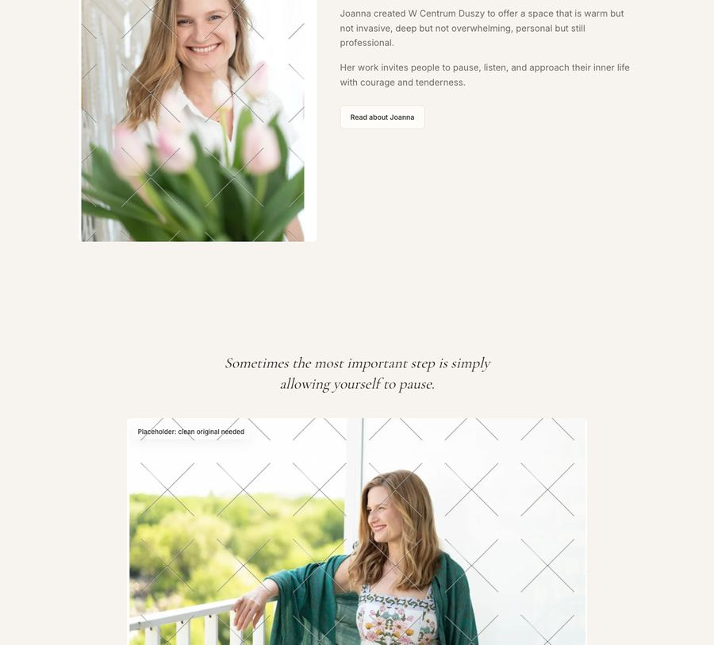
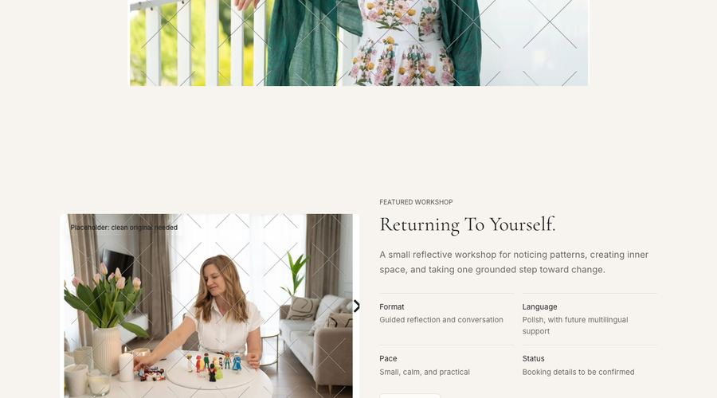
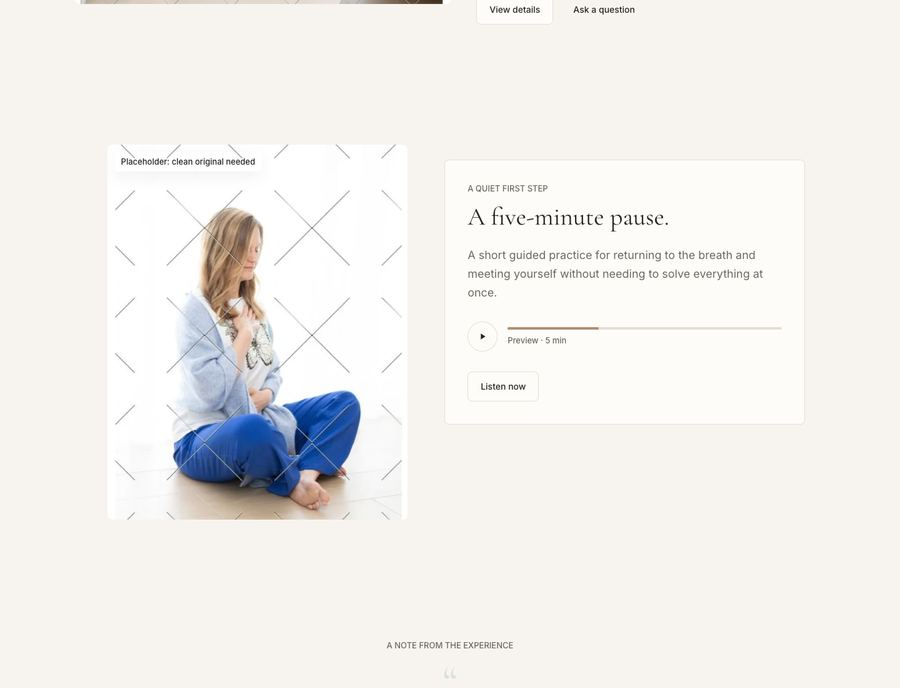
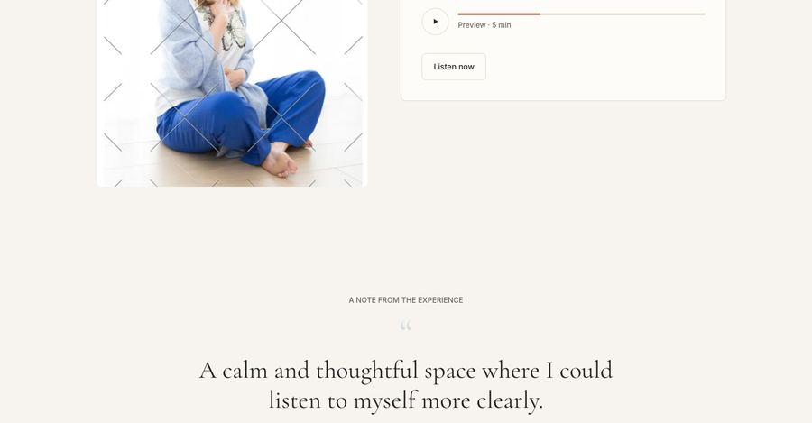
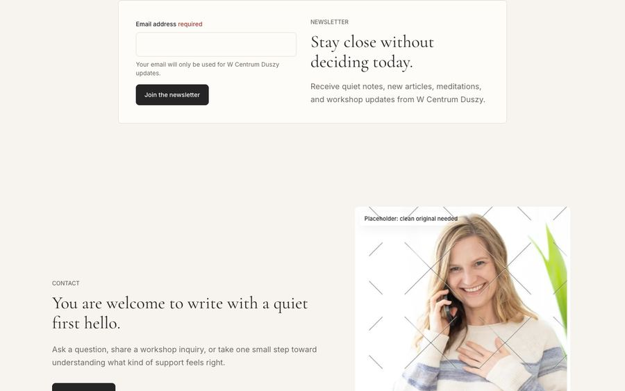

# Homepage Polish — Phase 2.2 Creative Review

**Scope:** Quality and craft refinements to the existing homepage only — no new pages, no new features, no CMS. Every change below is a layout, spacing, typography, or motion adjustment to content/components that already existed; no copy, brand voice, or information architecture was altered beyond the one new atmospheric section requested.

## Before / After

| | Desktop | Mobile |
|---|---|---|
| Before |  |  |
| After |  |  |

Full-page captures, scrolled through so all scroll-triggered content renders (see [Motion Refinements](#motion-refinements) for why that matters).

## 1. Hero Refinement

- Portrait container enlarged from `34rem` to `39rem` (+14.7%, within the requested 10–15%).
- Grid ratio shifted from `1fr / 0.82fr` to `1fr / 0.95fr` so the larger portrait has room without crowding the text column.
- Gap between text and portrait tightened from `gap-12` (48px) to `gap-10 lg:gap-8` (40px / 32px at desktop) — the two elements now read as one composition rather than two separate blocks.



## 2. Vertical Rhythm

Section padding was tightened from `py-20 / lg:py-28` to `py-16 / lg:py-24` across Trust Statement, Offer Pathways, About, Featured Workshop, Meditation, Testimonial, Newsletter, and Contact — one consistent step down, applied uniformly so the page still breathes evenly rather than becoming lopsided. Inter-column gaps in two-column sections (About, Workshop, Meditation, Contact) tightened from `gap-12` to `gap-10` for the same "feels connected, not just adjacent" reason as the hero.

The new atmospheric section (below) intentionally keeps *more* padding (`py-24 / lg:py-32`) than every other section — it's the one place on the page meant to feel spacious, by design, so the page's total height increases slightly even though every pre-existing section got tighter. That trade-off is the point: less wasted space where content is doing work, more space where the page is meant to pause.

## 3. Editorial Rhythm

Beyond the existing left/right image-text alternation (which was already in place), variation was introduced through:

- **Vertical alignment alternates**: About and Meditation now use `items-start` (top-aligned, magazine-style) instead of `items-center`, breaking up what was a uniformly centered rhythm through every section. Hero, Workshop, and Contact keep `items-center` for a calmer, settled feel at the page's emotional anchors.
- **Workshop section flipped**: image now leads (left), text follows (right), reversing the previous text-leads pattern and giving the page a third visual order instead of two repeating ones.
- **Workshop and Contact framing differ**: Workshop keeps its existing soft `bg-mist/55` tint; Contact now gets a lighter `bg-mist/30` tint as a closing bookend — distinct from the plain-background sections in between.

## 4. New Atmospheric Section

Added between About and Featured Workshop (within the requested "between Trust Statement and Testimonials" range, and at the page's pacing midpoint — right after the most text-dense personal section and before returning to practical "offer" content):

> *Sometimes the most important step is simply allowing yourself to pause.*

Set in italic display type, centered, with nothing else — no eyebrow label, no CTA, no card border — followed by a large, wide-format photograph with generous surrounding whitespace. No heading element was used (`aria-label` on the `<section>` instead) since this is atmosphere, not a topic introduction, and didn't need to appear in the page's heading outline.



**Photography choice:** used `joanna-radek-04` (previously unused on the homepage — tagged for "seasonal/outdoor" in the design system) rather than reusing an already-placed photo. It's the only shot in the set where Joanna is looking away from camera in a quiet, outward gaze rather than greeting the viewer — exactly the "pause" register this section needed, and its native 1.465 aspect ratio fits a wide crop with minimal cropping.

## 5. Photography

Reviewed every native image dimension against its rendered crop before changing anything (see table). No face or gesture is cropped tighter than before; two aspect changes were made because the native photo was a *better* match for a different box than the one originally chosen, not for visual variety's own sake:

| Photo | Native ratio | Used as | Change |
|---|---|---|---|
| `01` (hero) | 0.677 | `portrait` (0.8) | Unchanged — only the container size grew, not the crop. |
| `11` (about) | 0.708 | `portrait` (0.8) | Unchanged. |
| `13` (workshop) | 1.502 | was `landscape` (1.333) | → `wide` (1.6), closer to native, shows more of the room scene. |
| `16` (meditation) | 0.684 | `portrait` (0.8) | Unchanged. |
| `17` (contact) | 0.691 | `portrait` (0.8) | Unchanged — container enlarged ~10% (`28rem` → `31rem`), not re-cropped. |
| `04` (new, atmospheric) | 1.465 | `wide` (1.6) | New usage; ratio is a close match, crops minimally. |

## 6. Workshop Section

- Swapped to image-leads layout (see Editorial Rhythm) and gave the image column more width: `lg:grid-cols-[1fr_0.86fr]` (text bigger) → `lg:grid-cols-[1.08fr_1fr]` (image bigger).
- Aspect changed to `wide` per the photography table above, showing more of the room and the activity at the table rather than a tighter crop.



## 7. Meditation Section

- Replaced the boxed progress-bar-with-labels control (which read as an embedded audio-player widget) with a circular play affordance (reusing the design system's existing `Icon name="play"`, not a new dependency) beside a slim 1px progress line and a single `Preview · 5 min` caption. Removed the inner `bg-background` card-within-a-card wrapper that was creating the "software chrome" look.
- Section switched to `items-start` so the card's top aligns with the image's natural headroom instead of forcing both to the vertical center.



## 8. Testimonials

- Added a large (`text-[4.5rem]`), low-contrast (`text-mist`) typographic quotation mark immediately before the blockquote — typography, not a decorative icon, per the brief's "avoid decorative elements."
- Removed the `border-y` rule that previously framed the quote; the oversized mark now carries the visual hierarchy instead of a hard border.
- Quote type bumped slightly (`2.15rem/2.75rem` → `2.25rem/2.75rem`) with tighter `leading-[1.2]` for a more confident editorial set.



## 9. Newsletter

Experimented with form-first per the brief. Settled on: DOM order keeps copy before form (so screen readers and mobile — where the grid collapses to one column — still meet the context before the input), but at `lg:` the form visually leads via `lg:order-1` / `lg:order-2`. Calmer than a hard DOM reorder, because it doesn't change what a non-sighted or mobile visitor encounters first, only what desktop visitors see first.

## 10. Contact

- Portrait enlarged `28rem` → `31rem` (+10.7%).
- Section wrapped in a soft `bg-mist/30` tint, mirroring the Workshop section's treatment from earlier in the page — a deliberate bookend so the page's last content section feels distinct from the plain-background sections before it, closing on warmth rather than just stopping.



## Motion Refinements

- `Reveal` (the shared scroll-entrance animation used across every section below the hero): duration eased from `0.45s` to `0.6s`, vertical travel reduced from `12px` to `8px`. Slower and smaller — supports calm without disappearing entirely, since these sections genuinely are off-screen on load and a cue that new content has arrived is still useful.
- The hero's own entrance animation was **already removed in the prior deployment release** (it was identified as actively harmful — opacity-gated content the browser won't paint counts against Largest Contentful Paint). Re-confirmed during this pass that it stays removed; the hero now renders immediately, which is the most "disappeared" motion can get.
- `prefers-reduced-motion` was already respected via `useReducedMotion()` in `Reveal` — left untouched, verified still correct.
- Left the mobile navigation's open/close transition and card-hover/button-hover transitions as-is: those are interaction feedback (something happened because you clicked/hovered), not entrance choreography, and slowing them down would read as lag rather than calm.

## Micro-Details

- Normalized CTA group top-margins that had drifted to `mt-9` (Workshop, Contact) back to the `mt-8` used everywhere else.
- Confirmed consistent: card padding/radii, border color usage, heading-to-eyebrow spacing (`mt-3` everywhere), button transition durations (200ms), image corner radius (`rounded-md` inside `EditorialImage`, no per-instance overrides). No inconsistencies found worth changing.

## Verification

```
npm run lint        # pass
npm run typecheck    # pass
npm run build        # pass (static export)
```

Lighthouse (local static-server test — see caveat below):

| | Performance | Accessibility | Best Practices | SEO |
|---|---|---|---|---|
| Pre-polish (last production deploy) | 92 | 100 | 100 | 100 |
| Post-polish (local) | 76† | 100 | 100 | 100 |

† **Caveat, not a regression:** this local score was measured against a plain `python -m http.server` with no compression/caching, the same harness that measured the pre-polish code at 76 too (see Release 1's notes on this same confound) — it is not comparable to the 92 measured against the real GitHub Pages/Fastly CDN. No console errors, 0 cumulative layout shift, and `color-contrast` passes locally. The polish changes add one new image and a slightly longer (but below-the-fold, non-LCP) animation duration — nothing that should regress the real, CDN-served score. **Recommend re-running Lighthouse against the live URL after this branch deploys** to confirm the ≥95/100/100/100 targets hold; if Performance comes in under 95 it will almost certainly be the same image-weight/cache-header factors already documented as known issues in `docs/releases/RELEASE_1.md`, not something introduced here.

## Remaining Recommendations

- Re-run Lighthouse against the live deployed URL once this branch is merged, to get an authoritative (non-local-server) performance number.
- The new atmospheric-section photo (`04`) and the Workshop `wide` re-crop are still the same watermarked placeholders as everything else — revisit both crops once clean originals arrive, since a different real photo might suit the "pause" moment even better.
- Consider, in a future pass, applying the same "form visually first, DOM-order second" pattern used in Newsletter anywhere else a form competes with descriptive copy (none currently exist elsewhere on the homepage).
- The Testimonials section is still a single placeholder quote; once real testimonials exist, confirm the larger quotation mark and tightened type still read well with longer/shorter quote lengths than the current one.
